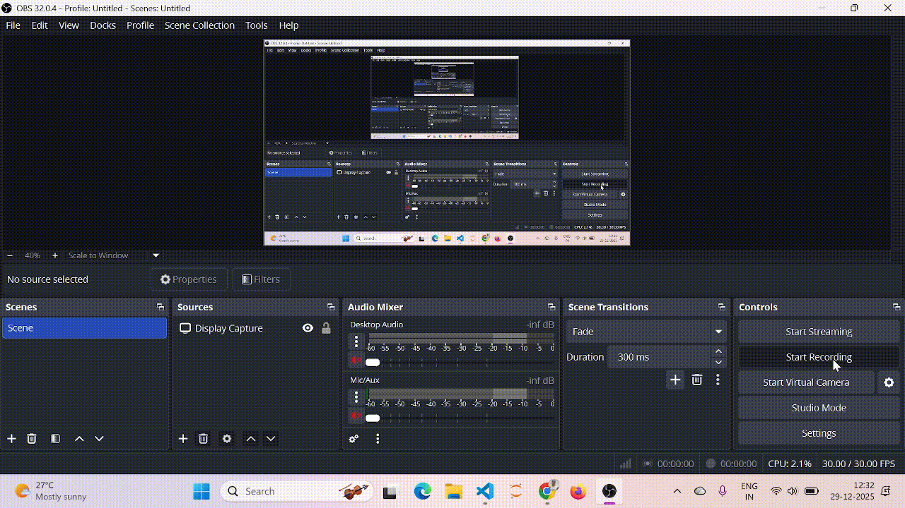

# Bengaluru House Price Prediction

A machine learning project to predict house prices in Bengaluru based on features like location, size, number of bedrooms, and total square footage.

## Project Overview

This project uses various regression models to predict real estate prices in Bengaluru. The model is trained on the Bengaluru House Data dataset and implements comprehensive data cleaning, outlier removal, and feature engineering techniques.

## Demo

Below is a short demonstration of the Bengaluru House Price Prediction system in action:


## Features

- **Data Cleaning**: Handles missing values, converts mixed formats, and extracts meaningful features
- **Outlier Detection**: Implements location-based and BHK-based outlier removal
- **Feature Engineering**: Creates price per sqft, handles rare locations, and applies one-hot encoding
- **Model Comparison**: Tests multiple regression models (Linear Regression, Ridge, Lasso)
- **Cross-Validation**: Uses 5-fold cross-validation for robust performance estimation
- **Comprehensive Metrics**: R², RMSE, and MAE in both log and original scale

## Dataset

The dataset contains information about houses in Bengaluru with the following features:

- **location**: Area/locality of the property
- **size**: Number of bedrooms (BHK)
- **total_sqft**: Total area in square feet
- **bath**: Number of bathrooms
- **price**: Price in lakhs (₹)

## Project Structure

```
Bengaluru_house_price_prediction/
├── data/
│   └── Bengaluru_House_Data.csv
├── model/
│   ├── model.pkl
│   └── columns.json
├── train_model.py
└── README.md
```

## Installation

### Prerequisites

- Python 3.7+
- pip

### Dependencies

Install required packages:

```bash
pip install pandas numpy scikit-learn
```

Or use a requirements.txt file:

```bash
pip install -r requirements.txt
```

## Usage

### Training the Model

Run the training script:

```bash
python train_model.py
```

This will:
1. Load and clean the dataset
2. Remove outliers
3. Engineer features
4. Train multiple models
5. Select the best performing model
6. Save the model and feature columns

### Making Predictions

```python
import pickle
import json
import numpy as np

# Load the model and columns
with open('model/model.pkl', 'rb') as f:
    model = pickle.load(f)

with open('model/columns.json', 'r') as f:
    columns = json.load(f)

# Prepare input data
def predict_price(location, sqft, bath, bhk):
    loc_index = -1
    if f'location_{location}' in columns:
        loc_index = columns.index(f'location_{location}')
    
    x = np.zeros(len(columns))
    x[0] = bath
    x[1] = bhk
    x[2] = sqft
    
    if loc_index >= 0:
        x[loc_index] = 1
    
    # Predict (model outputs log-transformed price)
    log_price = model.predict([x])[0]
    price = np.expm1(log_price)
    
    return round(price, 2)

# Example prediction
price = predict_price('1st Phase JP Nagar', 1000, 2, 2)
print(f"Predicted Price: ₹{price} Lakhs")
```

## Data Processing Pipeline

### 1. Data Loading
- Loads CSV file
- Drops unnecessary columns (area_type, society, balcony, availability)
- Handles missing values

### 2. Feature Extraction
- Extracts BHK from size column
- Converts total_sqft ranges to numeric values (handles "1000-1500" format)

### 3. Outlier Removal
- **Location-based outliers**: Removes properties where price per sqft is beyond 1 standard deviation from the location mean
- **BHK-based outliers**: Removes properties where higher BHK has lower price per sqft than lower BHK in the same location
- **Domain filters**: Removes properties with BHK > 20 or sqft per bedroom < 300

### 4. Feature Engineering
- Creates price_per_sqft feature
- Groups rare locations (≤10 samples) into 'other' category
- One-hot encodes location features
- Log-transforms target variable (price) to handle skewness

## Model Performance

The project compares three regression models:

| Model | Typical R² Score | RMSE (Lakhs) | MAE (Lakhs) |
|-------|------------------|--------------|-------------|
| Linear Regression | ~0.84 | ~25-30 | ~15-20 |
| Ridge Regression | ~0.84 | ~25-30 | ~15-20 |
| Lasso Regression | ~0.83 | ~26-31 | ~16-21 |

*Note: Actual performance may vary based on the dataset and random state*

## Key Insights

1. **Location is the strongest predictor** of house prices in Bengaluru
2. **Log transformation** of prices improves model performance due to skewed distribution
3. **Outlier removal** significantly improves model accuracy
4. **Ridge and Linear Regression** perform similarly, suggesting low multicollinearity

## Future Improvements

- [ ] Implement advanced models (Random Forest, XGBoost, Neural Networks)
- [ ] Add more features (distance to landmarks, age of property, amenities)
- [ ] Create a web interface using Flask/Streamlit
- [ ] Implement hyperparameter tuning with GridSearchCV
- [ ] Add time-series analysis for price trends
- [ ] Deploy model as REST API

## Contributing

Contributions are welcome! Please feel free to submit a Pull Request.

## License

This project is open source and available under the MIT License.

## Contact

For questions or suggestions, please open an issue on GitHub.

## Acknowledgments

- Dataset source: Kaggle - Bengaluru House Price Data
- Inspired by various real estate price prediction projects
- Built with scikit-learn and pandas

---

**Note**: This model is for educational purposes. Actual house prices depend on many factors not captured in this dataset. Always consult with real estate professionals for actual property valuations.